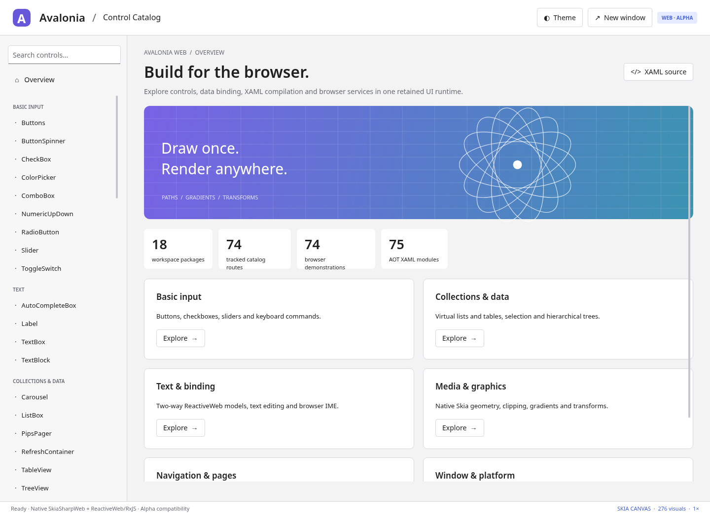

> **Weblonia publication:** ControlCatalog defaults to **full-isolation**.
> Explicit `single` and `render-worker` URL overrides remain available.
> See [publication details](docs/PUBLISHING.md) for validation scope and deployment.

# AvaloniaWeb

**0.6.2-alpha.1 — autonomous worker invalidation fixes, responsive column resizing and animation, plus the recovered worker-performance optimizations.**

This source distribution contains the complete implementation, the ControlCatalog
application, offline runtime dependencies, build tools, tests, documentation, and
individually packed npm libraries. It includes the intact 0.6.1 source, all 15 previously unpackaged worker-performance files, invalidation fixes, and rebuilt sample/worker graphs and library tarballs. See [recovery details](docs/RECOVERY.md).

The framework preserves familiar PascalCase APIs. UI layout, properties, bindings,
input routing and XAML object construction execute in JavaScript. Controls draw
through the actual native SkiaSharpWeb runtime rather than being restyled HTML
widgets. ReactiveWeb and RxJS are the actual supplied upstream distributions.

**Full upstream Avalonia/XamlX equivalence is not established.** This is a partial
manual port, not a complete mechanical translation of the original repositories.
The 74 catalog routes now all contain browser demonstrations, but the original
Fluent theme tree and every upstream catalog subexample have not been translated.
See [the compatibility contract](docs/COMPATIBILITY.md); exported names, route
counts and passing tests are not an upstream coverage percentage.



## Fixed in 0.6.2-alpha.1

Column resizing now updates realized cells without a hover; width-only changes keep
existing bindings and presenters. Indeterminate progress requests invalidate their
specific retained owner and stop when hidden/disposed or made determinate. Reentrant
Render/RenderAfter and custom worker OnRender invalidations survive frame completion.
Bitmap caches retain the correct final composition-animation frame rather than an
old snapshot. All three modes have autonomous, no-pointer-nudge regression tests.

The previous worker-performance work is included: per-packet string dictionaries,
direct UTF-8 encoding, sparse visual patches, immutable-reference validation caches,
shared text resources, native clip caching and deduplicated frame notifications.
Read [root causes and tests](docs/INVALIDATION-FIXES.md) and the current
[executed qualification report](docs/VERIFICATION.json).

## Fixed in 0.6.1-alpha.1

Both thread modes now install their initialize receiver before importing the
asynchronous runtime graph. The original canvas/ports cannot be lost while native
font dependencies evaluate. Startup failures report their cause/stage and clean up
workers, rather than silently waiting for a generic timeout. The standalone app's
worker imports are also rebuilt at their final deployment depth, including sites
hosted under a path prefix.

Tests now use real module workers rather than the classic test wrapper that
masked the original race. Source/dist/nested-path startup, delayed dependencies,
backend selection, failure cleanup and restart are covered. Ordinary HTTP has
an additional non-intercepted CI check. See [diagnosis](docs/WORKER-STARTUP-FIX.md)
and the executed [verification report](docs/VERIFICATION.json).

## Threaded composition introduced in 0.6.0-alpha.1

All three execution modes are included:

```text
?threading=single           main: UI + native Skia
?threading=render-worker    main: UI; worker: composition + native Skia
?threading=full-isolation   main: browser host; worker: UI; worker: composition + Skia
```

Append `&backend=canvas` for the qualified native raster path. The unchanged
single-thread mode remains the default. An explicitly requested threaded mode
reports unsupported capabilities instead of disguising an in-process fallback.

The render worker owns the transferred presentation canvas and committed server
scene. UI content records once per invalidation; unchanged native resources and
drawing lists are reused. One transferable transaction is in flight, with coherent
pending deltas, bounded buffers and separate processed/submitted completion.
Independent animations, registered custom worker handlers, explicit restart,
full-isolation text/native DOM/automation bridges and actual modal browser windows
are implemented. Opt-in compositor wheel scrolling uses sequence reconciliation
and virtualized-content coverage. No shared memory or COOP/COEP is required.

Fractional-DPI, browser-font and registered-native-font pixels are compared between
all three modes. Performance reports separate UI CPU time from submission latency:
threading moves work and may increase a serial round trip, not magically reduce
all raster costs. Each threaded window has its own render-side native heap; the
UI's synchronous geometry/text services also retain a native heap.

Read [threaded integration and ownership](docs/THREADING.md),
[qualification](docs/VERIFICATION.json), and [compatibility](docs/COMPATIBILITY.md).
The complete source contains the worker graphs, graph builder, protocol, application
factories, tests and the prebuilt deployment. No new npm publication or remote
repository write was performed for this release.

## Previous: 0.5.1-alpha.1 — performance trace optimizations

Effective property values, priority winners, metadata and inherited-property
inventories are cached with invalidation on changes, reparenting and metadata
overrides. Direct getters and arbitrary coercers remain live. Scalar TableView
rows/cells/presenters are retargeted while attached, with old binding observers
released. Custom templates keep their normal rebuild/dispose semantics.

The browser accessibility bridge retains DOM nodes, tracks label dependencies,
and updates only dirty semantics; paint-only frames do not rebuild the tree.
Layout invalidations and frame callbacks are coalesced. An explicit render
consumes its pending animation-frame request; scheduled paint-only frames reuse
known host dimensions. Accessibility and rendering scale are not disabled.

See [optimization details](docs/OPTIMIZED-RELEASE.md),
[current verification](docs/VERIFICATION.json), and
[compatibility boundaries](docs/COMPATIBILITY.md).

## Previous: 0.5.0-alpha.1

ScrollViewer, ListBox, TreeView, TableView and TextBox now use **actual retained
ScrollBar controls** on both axes instead of painted indicators. Thumb dragging,
page repeat, horizontal input, pointer capture, deferred scrolling, accessibility
ranges, Hidden/Disabled visibility, viewport clipping and keyboard focus are
exercised. Table headers follow horizontal scrolling. Multiline editors retain
selection while scrolling and bring the caret into the correct viewport.

The old painted thumbs could lose pointer input to child controls; horizontal
thumb interaction was missing. Browser drag testing also exposed and fixed a
virtualization layout loop caused by measure/arrange disagreeing about reserved
scrollbar space. Rows and default text presenters are now retargeted in place
rather than detached and reconstructed during every virtual range change.

Text measurement now owns and reuses editor/FormattedText layouts. Long-document
caret lookup operates on the selected line, and drawing culls offscreen lines
before measurement/rasterization/upload. Font metrics determine stable baselines;
ink bounds preserve combining-mark overhangs. Carets align to the actual device
transform without becoming too thin at high DPI. RangeBase now derives from
TemplatedControl and retains prior finite values on invalid numeric input.

See [scrolling and text changes](docs/SCROLLING-AND-TEXT.md),
[performance measurements](docs/PERFORMANCE.md), and
[the current verification report](docs/VERIFICATION.json).
SkiaSharpWeb remains pinned to the same previously merged revision
`0a33427592e788d042ab69eedeb4bd7f29f35564`; **no vendor/native renderer changes or
remote writes were made in this continuation**.

## Run the source

Node.js 22 or later is sufficient. No npm installation, .NET runtime, external CDN,
or build-time network access is required for the delivered application.

```sh
npm run build
npm start
```

Open `http://127.0.0.1:4173/`. To serve the complete prebuilt deployment tree:

```sh
node scripts/serve.mjs --dist
```

Alternatively, extract the standalone catalog archive and run:

```sh
python -m http.server 4173
```

Serve the entire directory over HTTP, not `file://`. Native `.wasm` files need
`application/wasm`. Module and asset paths are relative, including subdirectory
hosting. The supplied server binds loopback; use explicit `HOST`/`PORT` settings
only when network exposure is intended.

## Retained from the 0.3 release

| Subsystem | Working additions |
| --- | --- |
| Retained text | TextBlock/editor/label layout reuse; invalidation when text, metrics, font registration, width, inline content or paint changes. |
| Browser-font quality | Glyph-ink bounds, fractional device-grid placement, separate axis scaling, independently cached visible tiles and consistent measurement/raster settings. |
| Text algorithms | Bounded immutable grapheme data; memoized prefix advances; binary caret, wrapping and ellipsis searches for monotonic widths. |
| Native Skia | Reusable solid paints; multiple faces per family with independent ownership; memoized native paragraph descriptors. |
| Compiled bindings | Executable immutable paths and incremental observed stages, typed accessor delegates, streams, roots, casts, commands and AOT/runtime integration. |
| Recovery and evidence | Verified 882 baseline hashes, preserved provenance, clean source-change inventory, pixel tests, benchmarks and reproducible archive tooling. |

[Performance and text quality](docs/PERFORMANCE.md) explains the measured scope.
[Text and compiled-binding APIs](docs/TEXT-AND-BINDINGS.md) includes integration examples.
Previous functionality, including composition, TableView, formatting, automation,
container queries and platform adapters, remains in the complete source tree.

Existing functionality includes styled/direct/attached properties, binding
precedence and inheritance, ReactiveWeb MVVM, layout panels, controls/templates,
menus/flyouts, navigation, pointer capture/routed events, browser child windows,
modal results, native storage/clipboard adapters, diagnostics and headless tests.

## Libraries

Eighteen packages are included:

```text
@wieslawsoltes/avalonia                 aggregate facade and XAML registration
@wieslawsoltes/avalonia-base            properties, collections, primitives, threading
@wieslawsoltes/avalonia-data            bindings, paths, validation, selection
@wieslawsoltes/avalonia-media           drawing, geometry, text, text formatting
@wieslawsoltes/avalonia-styling         resources, selectors, container queries
@wieslawsoltes/avalonia-controls        retained controls, inline documents, automation
@wieslawsoltes/avalonia-animation       clocks, easing, transitions, keyframes
@wieslawsoltes/avalonia-composition     committed scenes, expressions, surfaces
@wieslawsoltes/avalonia-rendering       portable retained scene and composition server
@wieslawsoltes/avalonia-skia            native drawing and native paragraph backends
@wieslawsoltes/avalonia-browser         windows, input, accessibility, native HTML hosts
@wieslawsoltes/avalonia-opengl          WebGL2 lifecycle, leases and Skia transfer
@wieslawsoltes/xamlx                   XML/AST/transforms and JavaScript type system
@wieslawsoltes/avalonia-markup-xaml     Avalonia object construction and AOT integration
@wieslawsoltes/avalonia-reactiveui      ReactiveWeb integration
@wieslawsoltes/avalonia-themes-fluent   Fluent-style resource/style subset
@wieslawsoltes/avalonia-headless        deterministic non-browser test host
@wieslawsoltes/avalonia-diagnostics     visual/property inspection
```

The tarballs are local packages, not published npm releases. The source's loader
and import maps resolve them without registry access. See [packaging](docs/PACKAGING.md)
for standard consumers and the external dependency graph.

## Verification

The completed release qualification is recorded in `docs/VERIFICATION.json`, including
Node regressions, the original browser/text/scrollbar/accessibility suites, both
threaded catalog sweeps, cross-thread RGBA comparisons, integration tests,
performance measurements and all 18 packed-package consumers.

The authoritative counts, exact source fingerprint and qualification scope are in
[VERIFICATION.json](docs/VERIFICATION.json). The release gate requires a passing
Node suite, full 74-route Chromium sweep, scrollbar interaction tests at 1x and
1.25x, RGBA text/caret checks, 75 AOT modules and all 18 packed-package consumers.
Every runner records completion and rejects a changing source tree. Earlier
reports are retained as history, not counted as current evidence.

```sh
npm run verify:vendor
npm run test:record
npm run build
npm run pack:all
npm run test:packages
npm run inventory
npm run benchmark:scrolling

python -m pip install -r tests/requirements.txt
python -m playwright install chromium
python tests/browser.py --dist
python tests/text-quality.py
python tests/scrollbars.py
python tests/scrollbars.py --scale 1.25
python tests/automation-incremental.py
python tests/threading-browser.py
python tests/threading-integration.py
python tests/threading-quality.py
python tests/threading-catalog.py
python tests/threading-performance.py
npm run verify:release
```

The native text tests read an existing font in place. Set `AVALONIA_TEST_FONT` to
a suitable existing font file when the default Linux test font is unavailable;
otherwise the font-dependent cases explicitly skip. **No fonts are distributed.**

Chromium runs actual JavaScript, native Skia WASM, mouse/keyboard input, browser
windows and the accessibility tree. Successful local suites use local-asset interception. Ordinary HTTP browser
navigation was blocked in prior executions; it is not qualified by intercepted
requests. Browser policies are not modified. WebGL2 was unavailable in the recorded run: three GL tests
are skipped, not passed. Physical GPUs, Firefox/Safari/mobile, physical IMEs and
screen readers are not qualified. See [testing](docs/TESTING.md) and the machine-
readable [verification summary](artifacts/verification-summary.json).

## Integration and provenance

[Usage](docs/USAGE.md) covers hosting, binding and XAML.
[Extended APIs](docs/EXTENDED-APIS.md) covers the new subsystems.
[Architecture](docs/ARCHITECTURE.md), [API inventory](docs/API-INVENTORY.md),
[security](docs/SECURITY.md), and [release notes](CHANGELOG.md) accompany the source.

The upstream reference revisions are pinned in `docs/upstream-lock.json`.
Full upstream Git repositories are not included. `npm run sync:upstream` obtains
reference checkouts on a networked development machine; this cloning operation
was not executed in this delivery and does not itself establish port coverage.

MIT project license; third-party licenses and notices are retained separately.
This is not an official AvaloniaUI, XamlX, SkiaSharp or ReactiveUI release.
No remote GitHub commit, npm publication, or public deployment was performed in this continuation.
Local recovery checkpoints and an incremental source patch are preserved in the recovery workflow.
